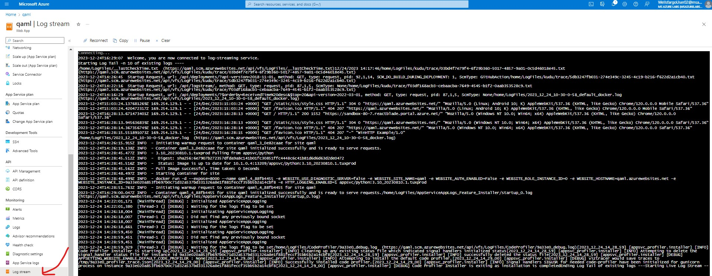

# Sample Flask Application
Checkout code from if needed `https://github.com/ganeshgowtham/AzureDeploymentWebApp`

1. Select the `App Service`

2. Create the Web App 

3. Create the web app by selcting  the appropriate `runtime`

4. App console

5. Select the `Log stream` for viewing the app logs
