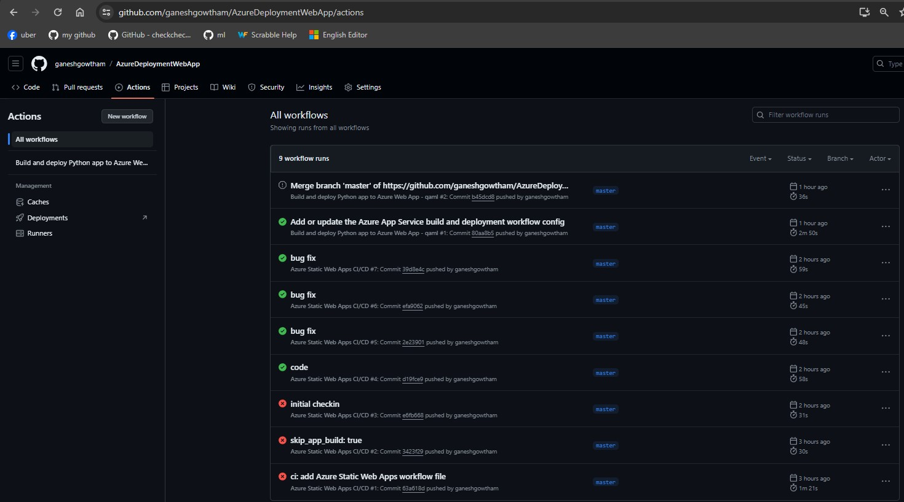
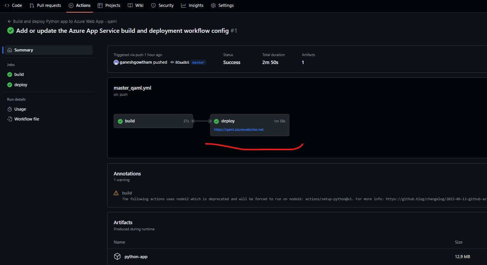
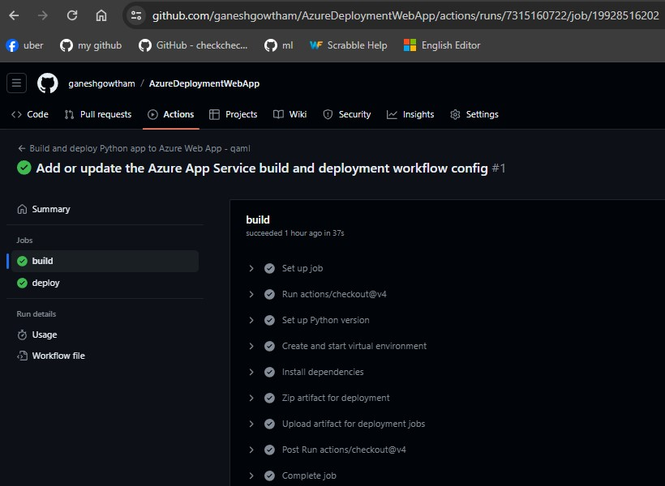
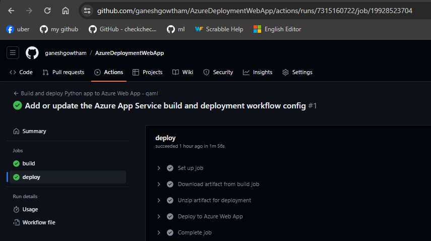

1. CICD yaml in this page will page will helpful to configure `auto-deploy` based on commit hook

2. Overall Workflow

3. Build Workflow

4. Deploy Workflow



# Sample CICD with Github actions
```yaml

# Docs for the Azure Web Apps Deploy action: https://github.com/Azure/webapps-deploy
# More GitHub Actions for Azure: https://github.com/Azure/actions
# More info on Python, GitHub Actions, and Azure App Service: https://aka.ms/python-webapps-actions

name: Build and deploy Python app to Azure Web App - qaml

on:
  push:
    branches:
      - master
  workflow_dispatch:

jobs:
  build:
    runs-on: ubuntu-latest

    steps:
      - uses: actions/checkout@v4

      - name: Set up Python version
        uses: actions/setup-python@v1
        with:
          python-version: '3.10'

      - name: Create and start virtual environment
        run: |
          python -m venv venv
          source venv/bin/activate
      
      - name: Install dependencies
        run: pip install -r requirements.txt
        
      # Optional: Add step to run tests here (PyTest, Django test suites, etc.)

      - name: Zip artifact for deployment
        run: zip release.zip ./* -r

      - name: Upload artifact for deployment jobs
        uses: actions/upload-artifact@v3
        with:
          name: python-app
          path: |
            release.zip
            !venv/

  deploy:
    runs-on: ubuntu-latest
    needs: build
    environment:
      name: 'Production'
      url: ${{ steps.deploy-to-webapp.outputs.webapp-url }}
    
    steps:
      - name: Download artifact from build job
        uses: actions/download-artifact@v3
        with:
          name: python-app

      - name: Unzip artifact for deployment
        run: unzip release.zip

      
      - name: 'Deploy to Azure Web App'
        uses: azure/webapps-deploy@v2
        id: deploy-to-webapp
        with:
          app-name: 'qaml'
          slot-name: 'Production'
          publish-profile: ${{ secrets.AZUREAPPSERVICE_PUBLISHPROFILE_162A983B38CD411CBB2182B2A380C36C }}
```