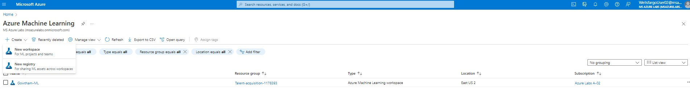
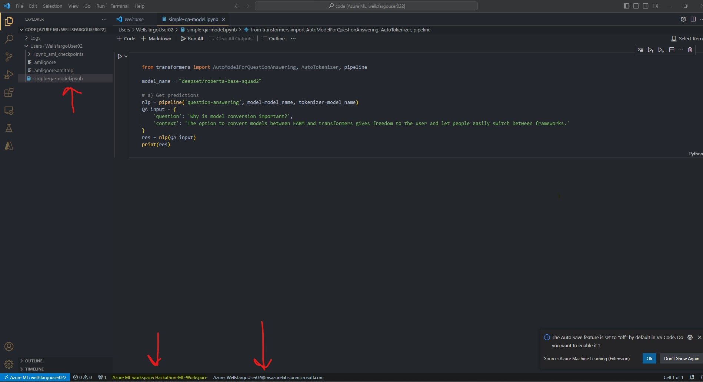

```Python
from azure.ai.ml import MLClient
from azure.identity import (
    DefaultAzureCredential,
    InteractiveBrowserCredential,
    ClientSecretCredential,
)
from azure.ai.ml.entities import AmlCompute
import time

try:
    credential = DefaultAzureCredential()
    credential.get_token("https://management.azure.com/.default")
except Exception as ex:
    credential = InteractiveBrowserCredential()

# connect to a workspace
workspace_ml_client = None
try:
    workspace_ml_client = MLClient.from_config(credential)
    subscription_id = workspace_ml_client.subscription_id
    workspace = workspace_ml_client.workspace_name
    resource_group = workspace_ml_client.resource_group_name
except Exception as ex:
    print(ex)
    
    # Enter details of your workspace
    # subscription_id="<SUBSCRIPTION_ID>",
    # resource_group ="<RESOURCE_GROUP>",
    # workspace = "<WORKSPACE_NAME>",
    
    workspace_ml_client = MLClient(
        credential, subscription_id, resource_group, workspace
    )
# Connect to the HuggingFaceHub registry
registry_ml_client = MLClient(credential, registry_name="HuggingFace")
print(registry_ml_client)
```